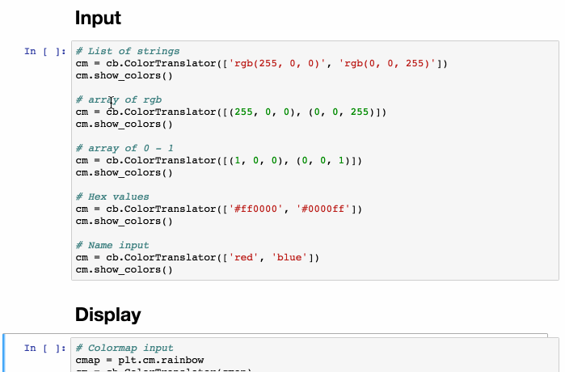

# colorbabel
Tools for quickly converting between representations of color in python. These can read and output many different representations of color. 

Check out the [example](https://github.com/choldgraf/colorbabel/blob/master/examples/demo.ipynb) for what you can do!

Or, try a live demo by clicking here:

